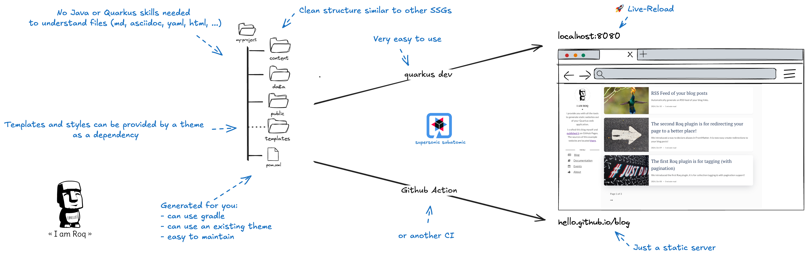

:title: {page.title}

Roq allows to easily create a static website or blog using Quarkus super-powers.

In this video, we initialise the repository and set up GitHub Pages, discover a few basics and create a new blog post.

++++

    <iframe width="560" height="315" src="https://www.youtube.com/embed/fWBFqbQusbs?si=wQ2EpqyT9PEhHdju" title="YouTube video player" frameborder="0" allow="accelerometer; autoplay; clipboard-write; encrypted-media; gyroscope; picture-in-picture; web-share" referrerpolicy="strict-origin-when-cross-origin" allowfullscreen></iframe>

++++

[#generate]
== Get up and running with Roq

{#include partials/doc/start-roq.adoc /}

== How it works

// https://excalidraw.com/#json=pZssfxY47ooeLKkHeH0cM,7jxUkcUdHu3WcR1ktCRFow

== Advantages of Roq

Knowing that *you don't need to learn Quarkus or Java* to use Roq, consider the following advantages:

1. *Quarkus-based*:
Since Roq is just a very thin layer on top of Quarkus, it ensures that the tool stays up to date and benefits from the robust support provided by the Quarkus ecosystem.

2. *For everyone*:
It is very easy to use with any level of knowledge. You can start with an existing theme (as a dependency) and only write Markdown or Asciidoc content, or customize everything.

3. *Reproducibility Across Platforms*:
Unlike some other SSG, Roq offers better reproducibility across multiple platforms, ensuring more consistent and predictable results when building or deploying.

4. *Easy to maintain*:
Managing dependencies and updates is easier with Roq thanks to Maven and Gradle. Other systems such as Go or Ruby can be difficult to maintain and make reproducible across environments.

5. *Speed*:
Roq is using Quarkus for dev and build. Quarkus is famous for being supersonic and subatomic, with one example showing a Roq site build in just 20 milliseconds, greatly reducing build times compared to traditional generators.

6. *Type Safety (via Qute templates)*:
Roq leverages Quarkus Qute's type safety in templates and posts, making it easier to handle links, data injection, and other dynamic content with confidence.

7. *Local Development Experience*:
Roq provides a smoother local development experience without the need to "test in production," as is often necessary with other SSGs due to its difficulties in running locally.

8. *Code Completion* (coming soon):
Thanks to Qute, Roq offers code completion, which is beneficial when working in templates, helping to reduce errors and improve developer productivity.

== The blog

You may find a few interesting things in there, here are 3 random articles from our link:{site.url}[blog].

++++
 
{#if site.collections.get('posts')}
{#for post in site.collections.get('posts').randomise.take(3)}
<article class="post">
  {#if post.image}
  
  {/if}
  

    <h2 class="post-title"><a href="{post.url}">{post.title}</a></h2>
    
{post.description}

    {post.date.format('yyyy, MMM dd')}&nbsp;&nbsp;&nbsp;—&nbsp;
    
      {post.readTime} minute(s) read
    
  

</article>
{/for}
{/if}
++++
