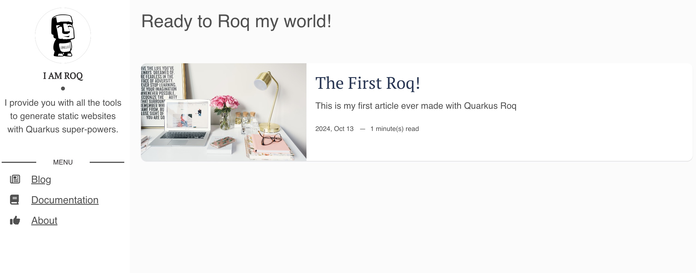
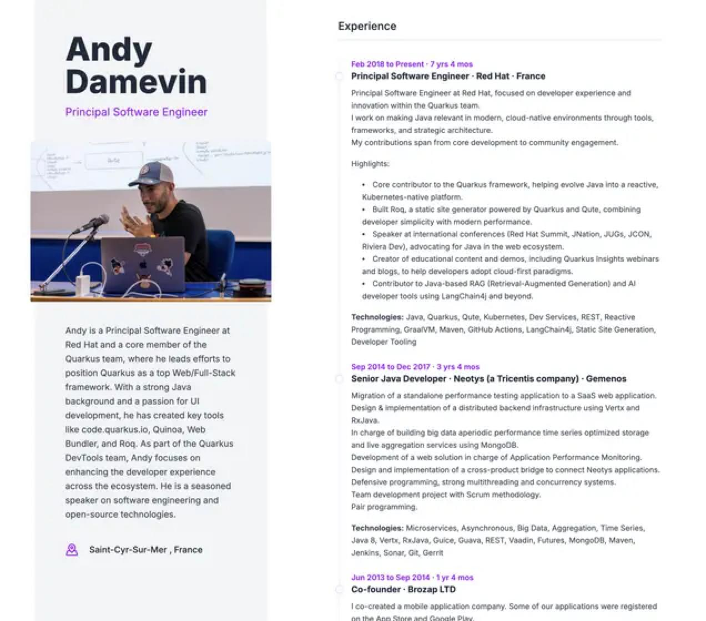

= Themes
include::../../includes/attributes.adoc[]
:doc-name: themes

include::../../includes/edit-contrib.adoc[]

It will provide templates, scripts and styles for your site. For advanced usage, refer to the xref:advanced.adoc#themes[*Theme section*].

To use a theme layout, refer to it with this prefix`:theme/`.

For example to use the page layout from the theme:
[source,html]
.roq-bottom.md
----
---
title: Roq Page
layout: :theme/page
---

<h1>Hello</h1>
----

[#roq-theme-default]
== Roq Theme default

This is the default Roq theme for a site or a blog (used on this site):

To install this theme, simply add the dependency to your pom.xml.
[source,xml]
----
<dependency>
    <groupId>io.quarkiverse.roq</groupId>
    <artifactId>quarkus-roq-theme-default</artifactId>
    <version>{cdi:project-info.release.current-version}</version>
</dependency>
----

List of layouts:
----
default/                // <1>
├── main/               // <2>
│   ├── index
│   ├── page
│   ├── post
│   └── tag
└── 404
----
<1> The overall HTML structure
<2> Shared site layout (e.g. header, nav, footer)

Here is the list of partials you may override:
----
├── partials
│   └── roq-default
│       ├── 404.html
│       ├── head.html
│       ├── pagination.html
│       ├── sidebar-about.html
│       ├── sidebar-contact.html
│       ├── sidebar-copyright.html
│       └── sidebar-menu.html
----

=== Social Brands

The default theme provides built-in support for social media links with icons. You can easily add social media links to your site.

To add social media links to your website, create or edit the website's index.html file:

[source,yaml]
----
social-github: quarkiverse
social-twitter: quarkusio
social-linkedin: john-doe
social-mastodon: https://mastodon.social/@username
social-whatsapp: 5511999999999
social-instagram: myproject
social-telegram: mychannel
----

### Available Social Brand Keys

- `social-twitter`
- `social-github`
- `social-linkedin`
- `social-linkedin-company`
- `social-facebook`
- `social-youtube`
- `social-discord`
- `social-email`
- `social-bluesky`
- `social-mastodon` (requires full URL)
- `social-slack` (requires full URL)
- `social-whatsapp`
- `social-instagram`
- `social-telegram`

NOTE: For Mastodon and Slack, you must provide the complete URL as these platforms don't have a standard prefix.

[#roq-theme-resume]
== Roq Theme resume

Creating your own online resume has never been this easy with the Roq theme for a personal resume:

To install this theme, simply add the dependency to your pom.xml.
[source,xml]
----
<dependency>
    <groupId>io.quarkiverse.roq</groupId>
    <artifactId>quarkus-roq-theme-resume</artifactId>
    <version>{cdi:project-info.release.current-version}</version>
</dependency>
----

Then add your resume info in the `data/` dir:

=== profile.yml

[source,yaml]
----
firstName: Ada
lastName: Lovelace
jobTitle: Computational Pioneer
city: London
country: United Kingdom
bio: |
  Ada Lovelace was a 19th-century mathematician known for her visionary work on Charles Babbage's Analytical Engine. She is widely regarded as the first computer programmer, having written the first algorithm intended for machine processing.
----

=== bio.yml

[source,yaml]
----
- title: Experience
  items:
    - header: "1842 - 1843"
      title: "Mathematician · Self-initiated · London"
      content: |
        Translated and annotated Luigi Menabrea’s paper on Charles Babbage’s Analytical Engine.
        Added extensive original notes, including the first published algorithm designed for a machine.
        Recognized as the first to see the general-purpose potential of computing.

        **Technologies:** Analytical Engine, Algorithmic Thinking, Mathematical Logic

- title: Education
  items:
    - header: "1830 - 1835"
      title: "Private Tutoring"
      content: |
        Studied mathematics and science under Augustus De Morgan and Mary Somerville, two of the most prominent scientific minds of the era.

    - header: "1828 - 1830"
      title: "Home Education"
      content: |
        Received a rigorous classical education at home, emphasizing mathematics, astronomy, and logic.
----

=== social.yml

[source,yaml]
----
- name: LinkedIn
  url: https://www.linkedin.com/in/ada-lovelace/
- name: X
  url: https://x.com/ada-lovelace
- name: Bluesky
  url: https://bsky.app/profile/ada-lovelace.bsky.social
----

=== Color Themes

The resume theme comes with 5 pre-configured color schemes that you can easily switch between. Each theme provides carefully selected colors that work well in both light and dark modes (Purple, Blue, Emerald, Amber, Rose and Cyan).

==== How to Apply a Theme

To use an alternate theme, create a stylesheet file in your project's `web/style.css` directory and import the theme:

[source,css]
----
/* Available: _theme-blue.css, _theme-emerald.css, _theme-amber.css, _theme-rose.css, _theme-cyan.css */
@import "./_theme-blue.css";
----

==== Custom Theme Colors

You can also create your own custom color scheme by overriding the theme variables in your `style.css` (link:https://github.com/quarkiverse/quarkus-roq/blob/main/roq-theme/resume/runtime/src/main/resources/web/_theme-emerald.css[See example,window=_blank])

The theme uses Tailwind CSS v4 color palettes. Available colors include: `slate`, `gray`, `zinc`, `neutral`, `stone`, `red`, `orange`, `amber`, `yellow`, `lime`, `green`, `emerald`, `teal`, `cyan`, `sky`, `blue`, `indigo`, `violet`, `purple`, `fuchsia`, `pink`, and `rose`.
