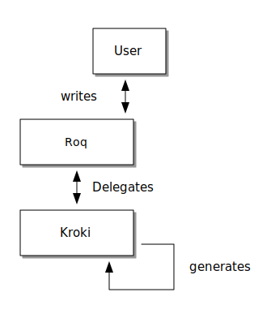

Autant vous aimez écrire du contenu au format textuel, autant vous aimez produire vos diagrammes sous forme de code.

Mais il y en a tellement : _PlantUML_, _Ditaa_, _Mermaid_, _BPMN_ et ainsi de suite.

Intégrer tous ces formats serait une véritable douleur.

Heureusement, vous n'avez pas à le faire, https://kroki.io/[*_Kroki.io_*] l'a déjà fait pour vous.

Un nouveau plugin a été ajouté pour intégrer ses capacités de manière transparente à *ROQ*.

Vous pouvez l'utiliser via un serveur déjà déployé ou laisser le plugin utiliser les services de développement Quarkus pour faire le travail à votre place.

// FIXME when window runner has a container runtime available

👉 La documentation complète est disponible link:/docs/plugins/#plugin-diagram[ici], faisons des diagrammes de tout !