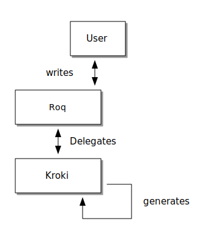

As much as you love writing content in a textual format, you like to produce your diagram as code.

But there are so many: _PlantUML_, _Ditaa_, _Mermaid_, _BPMN_ and so on and so forth.

Integrating all those formats would be a real pain.

Hopefully you don't have to, https://kroki.io/[*_Kroki.io_*] has already done it for you.

A new plugin has been added to integrate its capability seamlessly to *ROQ*

You can use it through an already deployed server or let the plugin make use of Quarkus dev services to do the job for you.

// FIXME when window runner has a container runtime available

👉 Full documentation is available link:/docs/plugins/#plugin-diagram[here], let's diagram all the things!