# Introduction
I don't blog that often.

It's not because I don't have ideas, quite the opposite. I have lots of them: ideas I want to share, experiments I want to document, things I want to remember. The real problem has always been time.

And yet, a personal blog is such a great place for all of this: sharing ideas, writing things down before they're forgotten, and keeping track of what you've learned along the way. How many times have you been in this situation?

> "I've already used this technology before… but it was on a customer project."

Three years later, you're asked to work on it again, and you have absolutely no idea how you did things back then.

> A blog is a memory extension.

A personal site is also a good way to keep your CV up to date: to show what you've worked on, what you've learned, and how your experience evolves over time. It's not just about writing posts, it's about telling your professional story.

Another thing that slowed me down was language. I'm never fully sure whether I should write in English or French. English makes more sense if I want to reach more people, but it's not my native language, so I've always felt a bit uncomfortable writing long-form content in it.

On top of that, my blog itself felt old. The design was… okay-ish. Good enough when I started. I used a Jekyll theme made by someone else (_Freshman21_), and I'm genuinely thankful to the author for that work, it helped me get started. But over time, I realized the site didn't really match my personality anymore. The theme felt too "lambda" (too generic).

On the technical side, Jekyll with GitHub Pages works fine, but as soon as you want to customize things, you start feeling a bit naked. I also kept wishing for a site generator more aligned with my daily work, something Java-based.

So yeah: time, language, visual identity, and technology were all reasons why I kept postponing this refresh.

But recently, AI changed the equation.

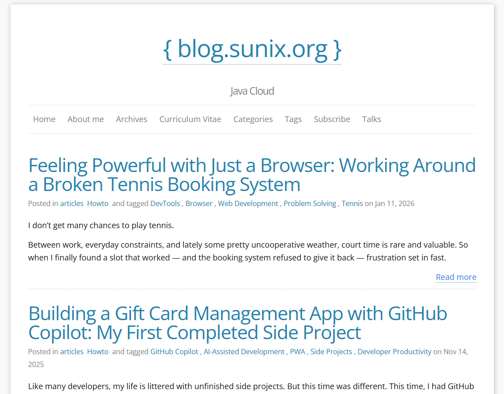
*This is what my blog looked like before the redesign and migration. The old Jekyll version is now archived at <a href="https://sunix.github.io/old-jekyll-blog.sunix.org/">https://sunix.github.io/old-jekyll-blog.sunix.org/</a>*

# Keeping Jekyll, Redoing the Design (Without a Theme)
Let's be honest: I'm not very good at design stuff.

I may have ideas, but CSS and I… we don't really get along. And it's not only about CSS. Whether it's Jekyll with Ruby, or even Hugo, I only know the basics. Once you want to go a bit further, things quickly become harder, and progress slows down.

At some point, I seriously considered switching technologies. I had heard about Quarkus Roq some time ago, and the idea of a Java-based static site generator was very appealing. But there was one big question in my head:

> _How am I going to migrate my existing Jekyll theme to Roq?_

After discussing with Andy, the creator of Roq, it became clear pretty quickly that this wouldn't be easy, at least not at my level. Roq uses Qute as its templating engine, which is very different from what Jekyll uses.

I took a look at how a Roq theme is structured, and honestly, it's quite straightforward. But migrating the _Freshman21_ Jekyll theme to Roq? That felt like a rabbit hole I really didn't want to go down.

So I gave up.

That was last summer.

## A Real Project, at the Right Time
Pretty much at the same time, I got a call from my tennis club asking for help.

Recently, the FFT (French Tennis Federation) shut down all CMS-based websites for many tennis clubs across France. Since I'm part of one of those clubs, I volunteered to rebuild a brand-new website from scratch.

It turned out to be the perfect opportunity to finally try Roq.

This time, I didn't have the Jekyll theme migration problem. No legacy constraints, no existing templates to port. I could start fresh. So I asked ChatGPT to generate a pure HTML/CSS website that could later be moved easily to _any_ static site generator.

The result was simple and clean:

- Tailwind CSS for styling
- Two static HTML pages:
    - a main page with different sections
    - an article page with a real content structure

Once I had that, moving it to Roq was surprisingly straightforward.

I extracted the common parts (header, footer, navigation) into `templates/partials` HTML fragments, then created proper layouts for:

- the main pages
- the article/post pages

Each layout simply includes the relevant partials.

For some parts of the site, I needed dynamic content. That's where I really enjoyed working with Roq. Instead of fighting a plugin system, I could just write Java. For example, I wanted file and image attachments to be automatically added to certain pages for download. This wasn't available out of the box, but creating a Qute template extension in Java was trivial.

I ended up with a small helper like this:  
<a href="https://github.com/tc11-fr/tc11.fr/blob/main/src/main/java/fr/tc11/FilesViewHelpers.java">https://github.com/tc11-fr/tc11.fr/blob/main/src/main/java/fr/tc11/FilesViewHelpers.java</a>

Which is then used directly inside templates, for example here:  
<a href="https://github.com/tc11-fr/tc11.fr/blob/main/templates/layouts/post.html#L55">https://github.com/tc11-fr/tc11.fr/blob/main/templates/layouts/post.html#L55</a>

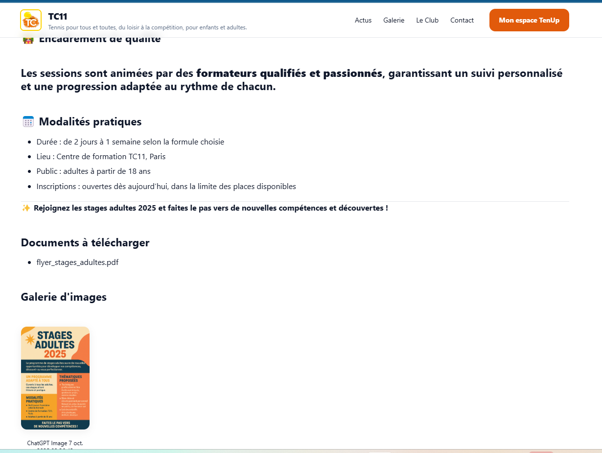
*An example article page displaying an image and a downloadable attachment, powered by a custom Java extension.*

That moment really clicked for me. I wasn't hacking around limitations anymore, I was extending the system in a clean, explicit way, using a language I'm comfortable with.

The Paris 11 Tennis Club website 🎾 is now live:

- 🌐 Website: <a href="https://tc11.fr/">https://tc11.fr/</a>
- 💻 GitHub: <a href="https://github.com/tc11-fr/tc11.fr">https://github.com/tc11-fr/tc11.fr</a>

## Coming Back to My Blog, Starting With the Design

With the Paris 11 Tennis Club website done, I finally had my first real Roq static website in production. At that point, I knew two important things.

First, I wouldn't need to rely on an existing theme to get a nice design anymore. Second, I could rely on AI to handle most of the CSS part, which, for me, is a huge relief.

I also realized that my initial idea, migrating an existing Jekyll theme to Roq, was simply not the right strategy. The theme itself was the problem. Migrating it would take a lot of time, and I'd rather spend that time building my own design that fits my personality.

Getting rid of the _Freshman21_ Jekyll theme on my blog would make the transition from Jekyll to Roq _much_ easier. The theme was the real blocker, not the content.

So I came up with a simple plan.

The first step was to completely drop the existing Jekyll theme and ask ChatGPT to generate a fresh website skeleton with _my_ design. Just like I did for the tennis club site, the idea was to start with a pure HTML/CSS static website. From there, I could extract reusable HTML fragments and make them work with Jekyll.

Once I had the new design running with Jekyll, without any theme, I knew the final step would be much simpler: moving the site to Quarkus Roq.

## Finding a Visual Direction (With a Lot of Help)

When it came to design, I had ideas… but nothing very precise.

My very first prompt was extremely simple:

> _"I'd like to refresh my blog website from a design point of view. Can you propose something cool?"_

ChatGPT came back with several design directions. They were all _fine_, but nothing really clicked. Everything felt a bit too safe, a bit too generic.

So I pushed further:

> _"I want something with a lot of colors, but still tech-oriented. Something that inspires joy."_

It generated a few concepts, but they didn't really feel joyful.

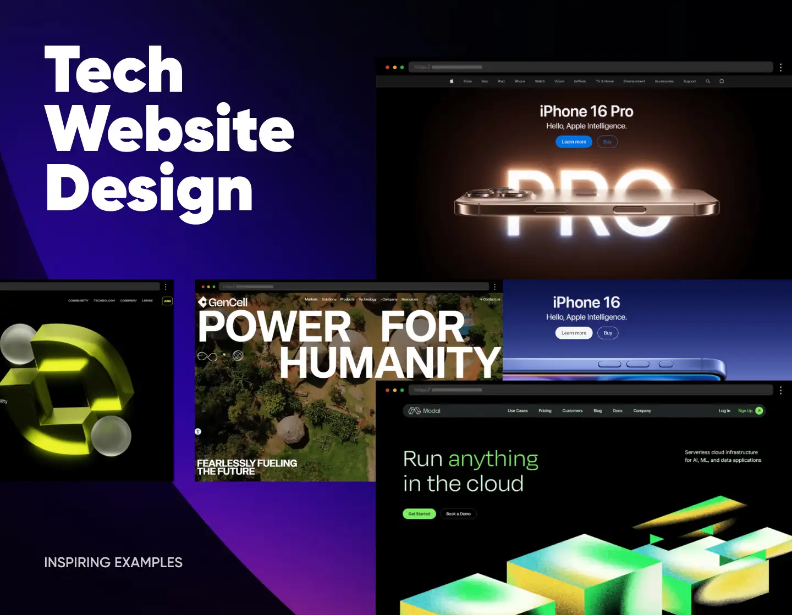

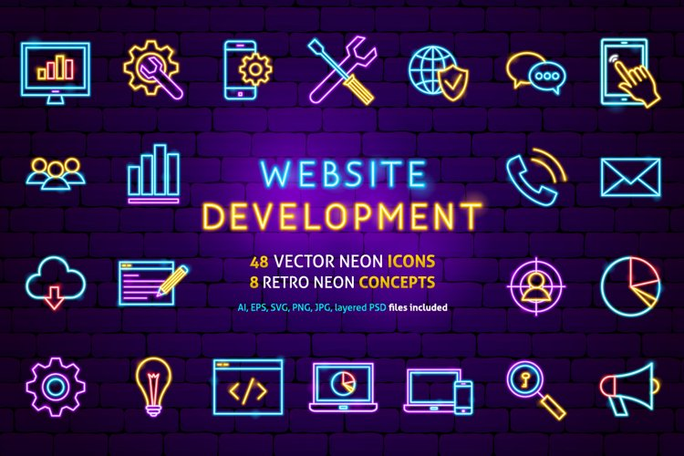

After asking for something colorful and tech-oriented, I wondered what would happen if I went even further:

> _"Ok, what would a street art style look like?"_

The results were interesting: bold, very expressive, lots of neon colors and heavy contrast.


After ruling out the street art direction, I tried to refine the idea instead of pushing it further:

> _"Street art that inspires creativity… but also code."_

Once again, ChatGPT proposed several examples. Most of them were interesting, but still not _there_. And then one image caught my eye.


It wasn't loud.  
It wasn't aggressive.  
But it was expressive, colorful, and clearly modern.

After a bit of digging, I realized it came from an article called _"How To Design the Perfect Hero Image"_:  
<a href="https://htmlburger.com/blog/hero-image-guide/">https://htmlburger.com/blog/hero-image-guide/</a>


## From Inspiration to a First Hero Illustration Attempt

I really liked the hero image style I had discovered, so the next step felt obvious: try to generate _my own_ version of it.

I described what I had in mind like this:

> _"A banner with a drawing similar to the 'How To Design The Perfect Hero Image' example: mostly black-and-white with a few elements in color. But instead of a woman on a couch, a developer wearing headphones, coding, and generating code that transforms into something (I don't know what yet)."_

The idea was clear:

- mostly black and white
- a calm, focused developer
- a splash of color to represent creativity
- code flowing out and turning into ideas

ChatGPT generated an image… and it was close. Very close.

But not quite what I wanted.


## Narrowing the Style: Less Noise, More Intention

At that point, I realized something important: the problem wasn't the _idea_, it was the _style_.

So I copied the reference image and told ChatGPT, very clearly:

> _"No, in **this** style."_
> 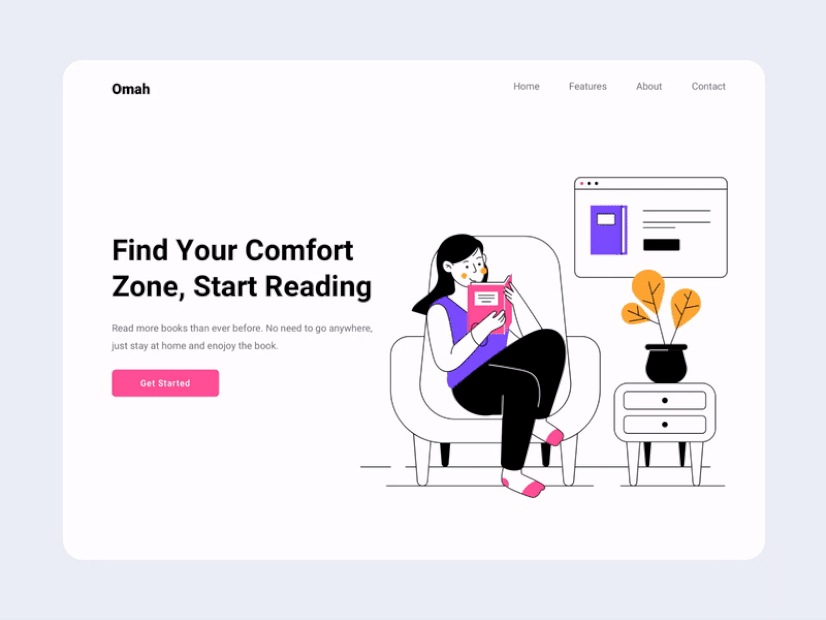

That made all the difference.

The illustration wasn't black and white as I originally suggested, but the result was even better: a pastel style with controlled colors. And the developer really looked like me… except for the missing glasses.

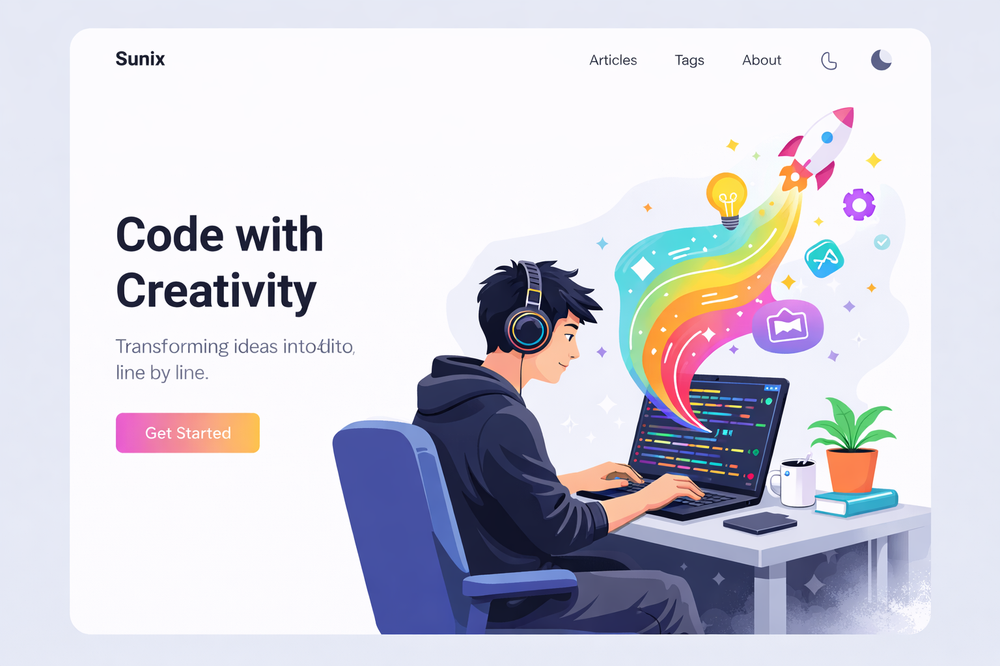

Then I added one last detail:

> _"And with glasses."_ 👓

And honestly… that was it.


It felt modern, joyful, and clearly tech-oriented. Most importantly, it finally felt like _my_ blog.

## From a Pretty PNG to a Working Website Skeleton

Once the hero illustration direction was clear, I wanted to stop "designing in my head" and start moving pixels on a real page.

So I asked for what I actually needed: not another image, not a moodboard, but a concrete, runnable mockup.

> _"Can you make me a complete mockup in this style?"_  
> _"Make me an HTML/CSS/Tailwind template, ready to plug in."_

That changed the workflow completely.

Instead of iterating on vague concepts, I now had a full HTML page with:

- a navbar (Articles, Tags, About…)
- a hero section designed around the illustration
- basic typography, spacing, and layout rules
- a structure reusable for posts and content pages

The first version used Tailwind via CDN, which was perfect for prototyping: copy/paste, open a browser, iterate fast.


## Getting the Hero Illustration Into the Skeleton (The "Transparent Background" Trap)

My skeleton was working, but it was still missing the most important part: the hero illustration.

So I tried the obvious next step: ask ChatGPT to generate the same hero image again, but with a transparent background.

In theory: perfect.  
In practice: not really.


The new image had a transparent background, as requested, but some details had disappeared, the mouth was missing, and the rocket and the light bulb looked unfinished. It felt more like a draft than the polished illustration I had before. It was a good image… just not _the_ one.

So I went back to the previous "perfect" image. AI got me 90% of the way, and for the last 10%, I brought out the classic: **GIMP**.

I extracted the character + desk + rainbow flow, cleaned the edges, removed the background, and exported a version ready to be integrated into the HTML page.

Not glamorous, but effective.


And once it was done… _huhey!_ 🎉  
I finally had the hero image exactly the way I wanted, in a format that actually works on the web.

At that point, the design was no longer just an idea. I had the hero illustration, the HTML layout, and the Tailwind CSS, something real I could build on.

The next step was simple: make it work with Jekyll first.

I wasn't going to redesign and migrate to Quarkus Roq all at once. I preferred small steps, each one reducing risk and keeping things manageable.

# GitHub Issues Driven Development (a.k.a. Coding Without an IDE)

Recently, I adopted a new way of building applications with AI, and without even opening an IDE.

I call it **GitHub Issues Driven Development**.

The idea is simple: instead of starting in my IDE, I start with **GitHub Issues**. For each new feature or bug fix, I create an issue, assign it to **@Copilot**, and let it handle the first iteration.

Copilot creates a pull request and does the work. I don't sit there watching it, I just go on with my day. Then, during my next coffee break, I come back to review the PR.

If something isn't right, I leave feedback directly in the PR comments, mentioning **@copilot**. It adjusts the code, I review it again, and we iterate like that. Short cycles, low mental load, very little context switching.

Most of the time, I end up merging the PR **without ever opening my IDE**.

I've already written more details about this workflow in a previous post:  
👉 <a href="https://blog.sunix.org/posts/building-a-gift-card-management-app-with-github-copilot-my-first-completed-side-project/">https://blog.sunix.org/posts/building-a-gift-card-management-app-with-github-copilot-my-first-completed-side-project/</a>

## Applying This Workflow to My Blog Redesign

So once I had the HTML/CSS skeleton and the hero illustration ready, I didn't start manually refactoring files.

Instead, I went back to GitHub.

In my blog repository, I created a new issue with a very explicit description:

**Title:** Redesign the website

- Remove the current theme
- Use a custom design inspired by the provided HTML/CSS
- Include the new hero illustration on the main page

I pasted:

- the generated HTML/CSS
- the hero illustration

That was enough.

Copilot picked up the issue and did the heavy lifting:

- removed the existing Jekyll theme
- reorganized the layouts
- integrated the new design
- wired everything together so the site still builds correctly

You can see the issue here:   
👉 <a href="https://github.com/sunix/blog.sunix.org/issues/44">https://github.com/sunix/blog.sunix.org/issues/44</a>

And the resulting pull request here:  
👉 <a href="https://github.com/sunix/blog.sunix.org/pull/45">https://github.com/sunix/blog.sunix.org/pull/45</a>

Of course, it wasn't perfect on the first try. I had to adjust a few minor things, fix small issues, and guide Copilot through comments. But overall, it _did the job_.

More importantly, it fit perfectly within my constraints: limited time, short bursts of focus, and the desire to keep momentum without mentally reopening a big "side project."


## Previewing a Pull Request (Without an IDE)

With this workflow, working mostly from GitHub and without an IDE, it's hard to validate changes just by looking at a diff in a pull request.

Sure, GitHub Copilot runs tests (and you can trust them… to a point), but when you're working on a website, you really want to **see** the result.

With Quarkus Roq in a local development environment, I would normally just run:

```sh
./mvnw quarkus:dev
```

But here, I'm only using the GitHub UI and reviewing a PR.

So I needed a way to preview what Copilot generated.

### The `/preview` Command

On several GitHub Pages projects I've worked on recently, I set up a simple but very effective mechanism: a `/preview` comment on a pull request.

When I comment `/preview` on a PR, it triggers a GitHub Action that:

- checks out the PR branch
- builds the static site
- deploys it to **surge.sh** (a static site hosting service with a free plan, more than enough for preview environments)
- posts the preview URL directly as a comment on the PR
- adds a clear banner to indicate that the preview site is _not_ the production version

Technically, the deployment is very simple: build the site, then run the `surge` command.

This gives me a real, clickable version of the site to review during my coffee break, exactly what I need when I'm not opening an IDE.


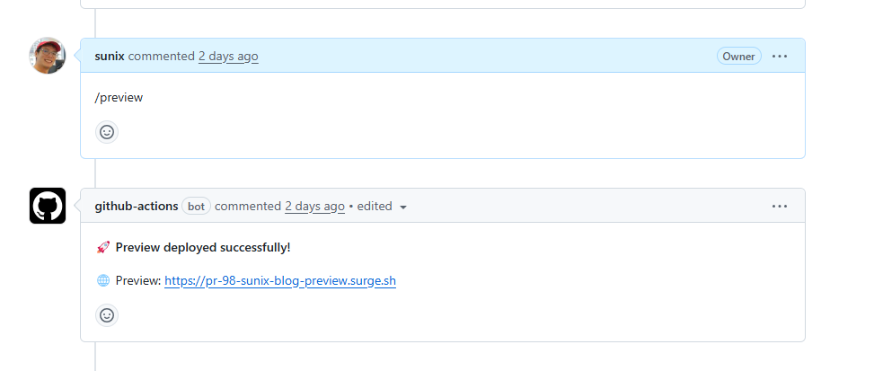
*I simply comment `/preview` on the PR, and the preview site is automatically deployed and made available.*


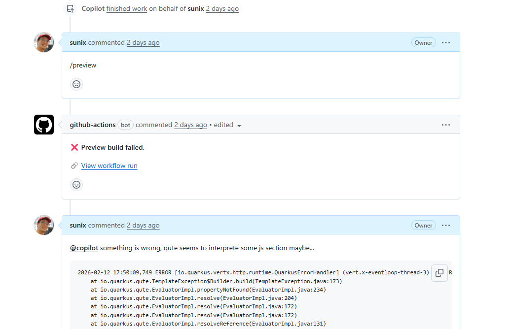
*If the deployment fails, I can investigate by checking the GitHub Actions workflow logs.*

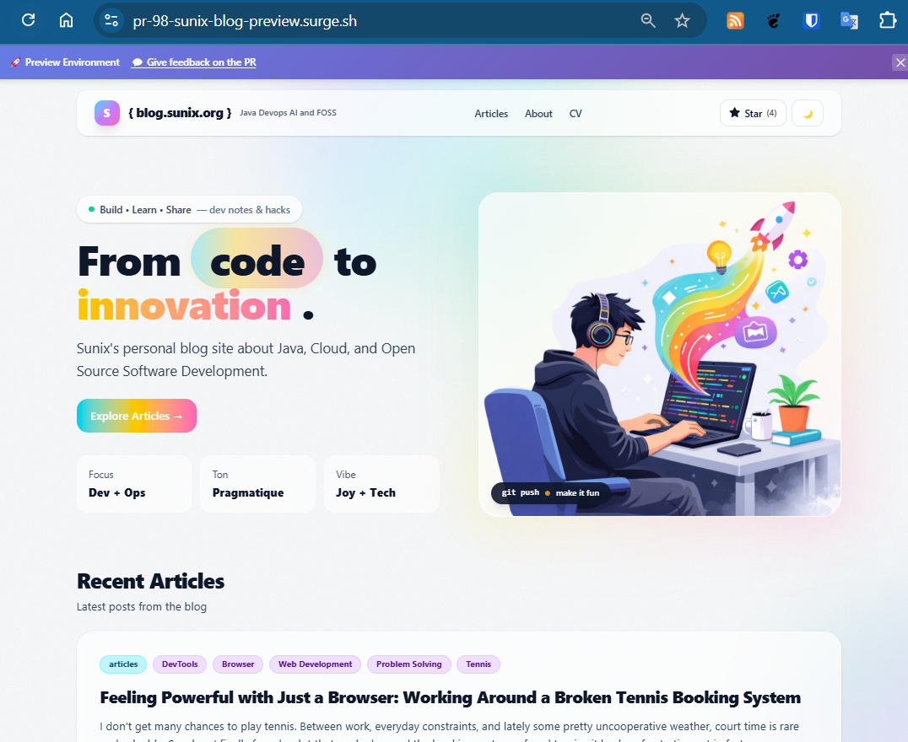
*In some projects, I also added a banner to clearly indicate that this is only a preview site, with a link back to the corresponding pull request.*

### Bootstrapping the Feature With… an Issue

And yes, I use the same GitHub Issues Driven Development workflow to set this up.

When I want this feature in a new GitHub Pages project, I usually create an issue like this:

- **Title:** Add a preview command in GitHub PR comments to have a preview on surge.sh
- **Description:** Getting inspiration from this PR:  
    <a href="https://github.com/SCIAM-FR/sciam-fr.github.io/pull/151">https://github.com/SCIAM-FR/sciam-fr.github.io/pull/151</a>
- **Assignee:** `@copilot`

Most of the time, Copilot proposes a pull request that includes:

- the GitHub Action workflow
- the `/preview` command handling
- the deployment logic

From there, I review it, tweak it if needed, and merge it.

This preview mechanism is what makes the whole workflow viable. Without it, reviewing HTML/CSS changes blindly would be frustrating. With it, I can confidently validate design changes, layouts, and content, even when everything happens through GitHub.

# Moving from Jekyll to Quarkus Roq

At this point, I had a Jekyll site **without a theme**. No complex plugins, no hidden magic, just content, layouts, and HTML.

So I thought:

> _This should be easy now._

Time to move to **Quarkus Roq**.

And of course, I followed the same workflow as before: create a GitHub issue and assign it to **@copilot**.

Since I had already built a GitHub Pages site with Roq for the tennis club, I simply reused that repository as a reference.

- **Issue:** <a href="https://github.com/sunix/blog.sunix.org/issues/60">https://github.com/sunix/blog.sunix.org/issues/60</a>
- **Title:** Replace Jekyll with Quarkus Roq
- **Description:** Getting inspiration from  
    <a href="https://github.com/tc11-fr/tc11.fr">https://github.com/tc11-fr/tc11.fr</a>

Copilot picked it up and produced a pull request:  
👉 <a href="https://github.com/sunix/blog.sunix.org/pull/61">https://github.com/sunix/blog.sunix.org/pull/61</a>

At first glance, it looked good. The project structure was there, the site was building, and the content was being rendered.

But… it didn't work **out of the box**.

## Reality Check: Migration Is Never Just One Issue

Once I started testing things more carefully, a few problems surfaced. So I did what I now do instinctively: I created more issues.

- <a href="https://github.com/sunix/blog.sunix.org/issues/63">https://github.com/sunix/blog.sunix.org/issues/63</a>  
    Qute was interpreting `$\{current.class.fqn\}` inside code blocks as a template expression, causing rendering failures with errors like:
    _Key 'current' not found_.
- <a href="https://github.com/sunix/blog.sunix.org/issues/65">https://github.com/sunix/blog.sunix.org/issues/65</a>  
    The GitHub workflow was uploading the GitHub Pages artifact twice. The `quarkiverse/quarkus-roq@v1` action already uploads it, and the workflow tried to upload it again, causing a conflict.

Each issue described one concrete problem. Each one was assigned to **@copilot**. And step by step, Copilot fixed them.

At that point, everything still wasn't perfect.

But the important thing was this:

👉 **The site was now running on Roq.**

That was a big milestone.

From there, I wasn't migrating anymore, I was improving.


## The Next Problems to Solve

Once the migration was complete, a new checklist appeared.
The site was running on Roq, but it wasn't fully production-ready yet.
Here's what still needed to be addressed:

- Excerpts were no longer working
- Old URLs were broken and needed proper redirects
- Disqus comments were gone
- Tailwind was still being loaded via CDN instead of using a production build
    

None of these issues were critical on their own. The site worked. The content was accessible.
But together, they made the difference between:

> "It runs."

and

> "It's clean, polished, and production-ready."

Each of these problems deserved its own issue, and its own iteration.
And that's exactly how I approached them.


## Bringing Back Excerpts (`<!-- more -->`)

One thing that immediately stood out after the migration was the lack of **excerpts**.

On my Jekyll blog, I was using the classic `<!-- more -->` marker to define a short preview of each post, displayed on the homepage. It's a small detail, but an important one: excerpts make the homepage more readable and give context before clicking into an article.

After migrating to Quarkus Roq, that feature was simply gone.

The posts were still there, but the homepage list only showed metadata: title, tags, date, and a "read more" button. No preview text anymore.

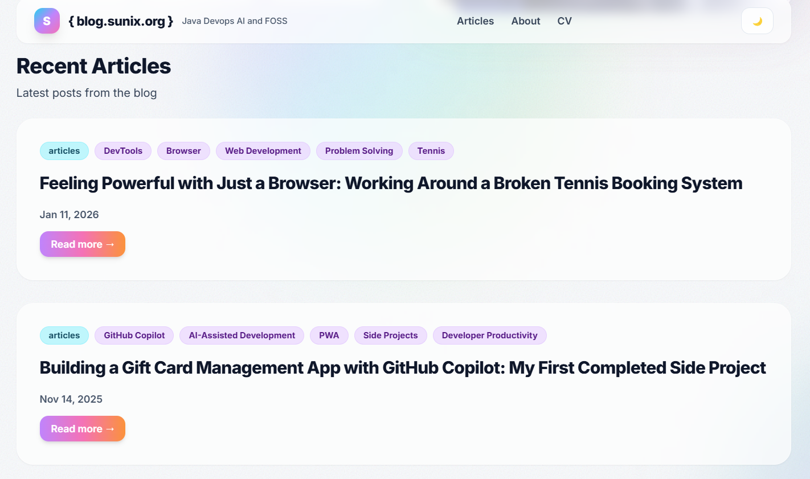
*After migrating to Roq, the homepage list only displays metadata (title, tags, date) and a "read more" button, the excerpt is missing.*


 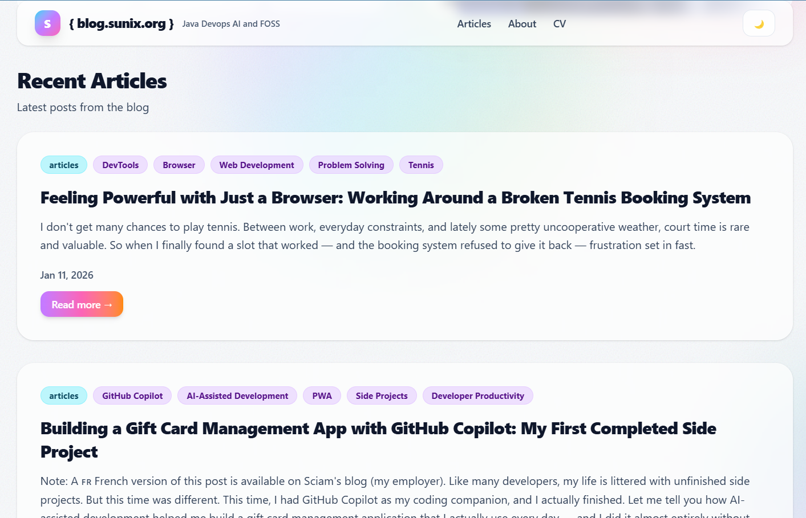
*This is how it should be: meaningful preview text extracted from each article, giving context before clicking "read more."*

I noticed it right away during the migration PR, but I deliberately chose **not to fix it there**. The migration pull request was already quite large, and I prefer one PR per concern. Also, the site was usable without excerpts, so it wasn't blocking.

I even documented the limitation directly in the PR comments:

> **Note on article excerpts:**  
> Roq doesn't expose the content before `<!-- more -->` through the template API.  
> The articles contain the marker in their Markdown, but there's no `excerpt` or `content` property available on the post object. The current layout only shows tags, title, date, and the read more button.

At that point, it was clear that this wasn't just a template tweak.

### Turning It Into a Proper Issue

Later on, once the migration had stabilized, I went back to my usual **GitHub Issues Driven Development** workflow.

I created a dedicated issue:

- <a href="https://github.com/sunix/blog.sunix.org/issues/68">https://github.com/sunix/blog.sunix.org/issues/68</a>
- **Title:** Implement Excerpt capability

In the issue description, I explained the problem and proposed a technical solution.

To extract the content before `<!-- more -->`, we would need to:

- Create a **Qute `@TemplateExtension`** that adds an `excerpt()` method to `DocumentPage`
- Access the raw Markdown content
- Parse it and extract everything before the marker
- Convert it to HTML
- Strip the HTML tags and return clean preview text
    

In short: this wasn't just templating, it required custom Java code.

I even sketched the idea directly in the issue:

```java
@TemplateExtension
public class ExcerptExtension {
    public static String excerpt(DocumentPage post) {
        // Read markdown file
        // Extract content before <!-- more -->
        // Convert to HTML
        // Strip tags
        return extractedText;
    }
}
```

And then I concluded the issue with a simple decision:

> Let's create this extension.


### And… It Worked 🎉

Copilot picked up the issue and implemented the whole solution in this PR:  
👉 <a href="https://github.com/sunix/blog.sunix.org/pull/69">https://github.com/sunix/blog.sunix.org/pull/69</a>

And just like that, excerpts were back.

The homepage now displays meaningful previews again, just like it did with Jekyll, but this time implemented cleanly in Java as a proper extension.

This was one of those moments where Roq really shined for me:

- No plugin hacks
- No fragile template tricks
- Just explicit, readable Java code

Problem solved. Hooray 🚀

## Tailwind in Production

Once the site was running on Roq, I opened the browser console.

And there it was:
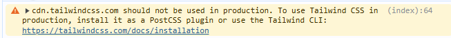
```
(index):64 cdn.tailwindcss.com should not be used in production. To use Tailwind CSS in production, install it as a PostCSS plugin or use the Tailwind CLI: https://tailwindcss.com/docs/installation
```

And indeed, I was still using:

```html
<script src="https://cdn.tailwindcss.com"></script>
<script>
  tailwind.config = {
    darkMode: "class",
    theme: {
      extend: {
        fontFamily: { ... },
        boxShadow: { ... }
      }
    }
  }
</script>
```
In this mode, Tailwind downloads a JavaScript file in the browser and generates the final CSS dynamically at runtime.
That's perfectly fine for development.
But not ideal for production.

### Why CDN Tailwind Is Not Ideal

There are a few reasons:

- It relies on an external JavaScript resource (which can be problematic in restricted environments).
- The JS file is larger than the compiled CSS would be.
- CSS is generated dynamically in the browser on every page load.
- Slightly slower performance overall.
    

For a proper production setup, Tailwind should:

- Scan your templates at **build time**.
- Generate **only the CSS classes you actually use**.
- Output a small, optimized static CSS file.

That's the correct way to use Tailwind in production.

### Doing It Properly With Roq

I had already solved this problem for the Paris 11 Tennis Club website.

At first, I implemented a manual Maven exec command:  
👉 <a href="https://github.com/tc11-fr/tc11.fr/pull/111">https://github.com/tc11-fr/tc11.fr/pull/111</a>

Later, I discovered that **Quarkus Roq supports Web Bundler + Tailwind**, so I switched to the proper integration:  
👉 <a href="https://github.com/tc11-fr/tc11.fr/pull/120">https://github.com/tc11-fr/tc11.fr/pull/120</a>

So applying the same approach to my blog looked straightforward.

I implemented it here:  
👉 <a href="https://github.com/sunix/blog.sunix.org/pull/85">https://github.com/sunix/blog.sunix.org/pull/85</a>

But… it wasn't working.


*This is what happened when switching to dark mode: the text color changed, but the background didn't, leaving grey text on a white page and making the article difficult to read.*
### Dark Mode Was Broken

After switching to the production build setup, the dark/light mode toggle stopped working properly.

Copilot tried to fix it:  
👉 <a href="https://github.com/sunix/blog.sunix.org/pull/93/commits/b74d4bd5fbe4053882d9f98805b8d72f1f9b4ed9">https://github.com/sunix/blog.sunix.org/pull/93/commits/b74d4bd5fbe4053882d9f98805b8d72f1f9b4ed9</a>

But the fix only addressed the button state, not the actual theme-switching logic.

So I went into debugging mode.

I compared the new version with an older working one and started investigating the differences. During a live Copilot session, I finally discovered the real issue:

👉 I wasn't using the correct Tailwind version.

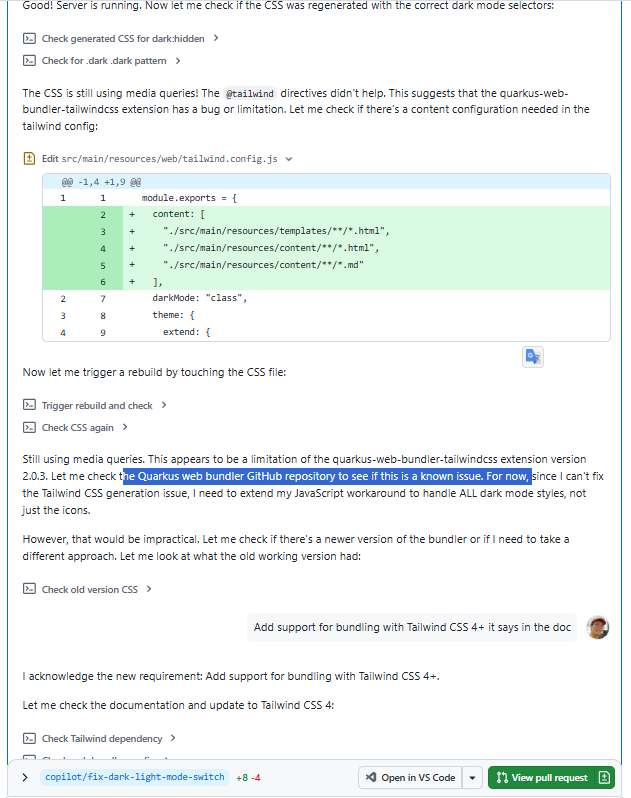


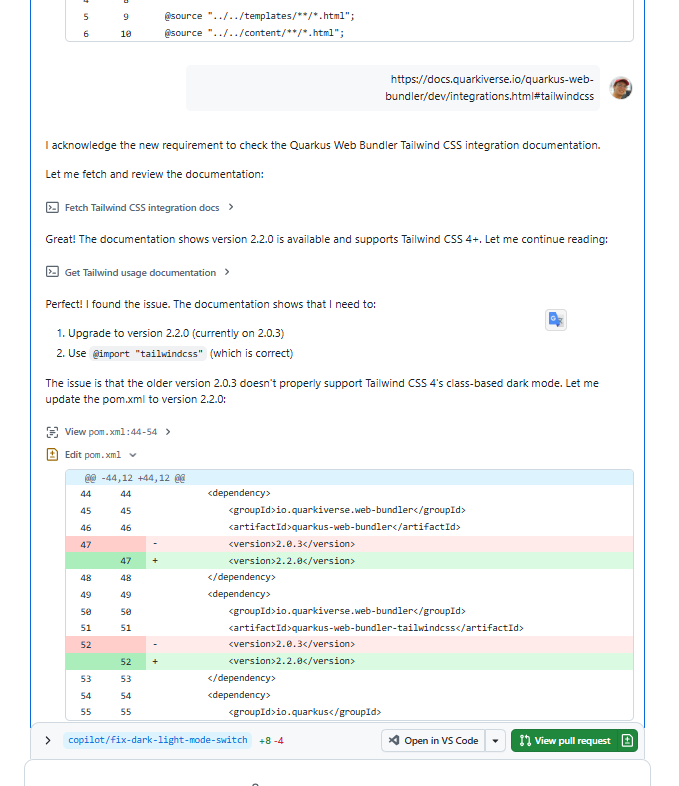

I provided some guidance, but Copilot did most of the work, and helped uncover that the project was using an outdated version of the Quarkus Web Bundler.

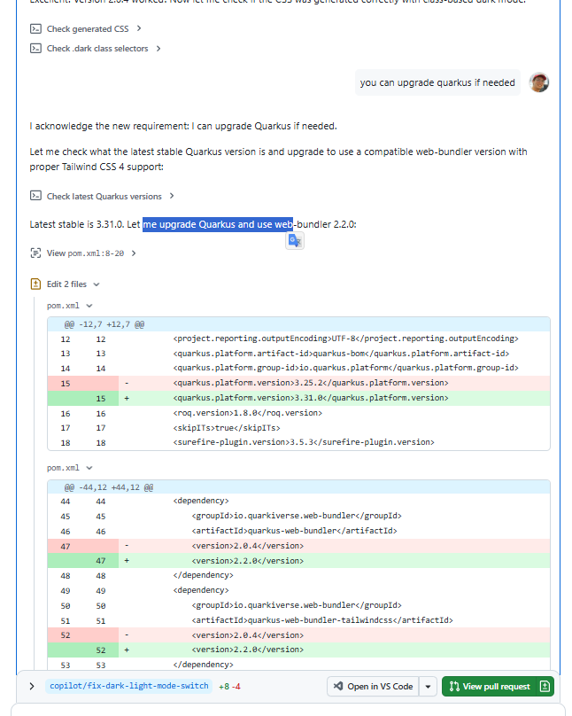

The setup was supposed to work with **Tailwind CSS 4**, but my project was effectively using an older configuration via an outdated Quarkus Web Bundler plugin.

Even worse, Copilot hadn't initially spotted that the project was using older versions of:

- Quarkus
- `quarkus-web-bundler-tailwindcss`

Once I upgraded the relevant dependencies, everything fell back into place.

The final fix was mainly:

- Upgrading Quarkus
- Upgrading the Tailwind Web Bundler extension
- Aligning everything with Tailwind CSS v4 

After that, dark mode worked perfectly again, and Tailwind is now compiled at build time into a properly optimized CSS file.

One thing I still need to fully understand is how this behaves in dev mode. I assume it falls back to dynamic generation during development, but I haven't explored that in depth yet.

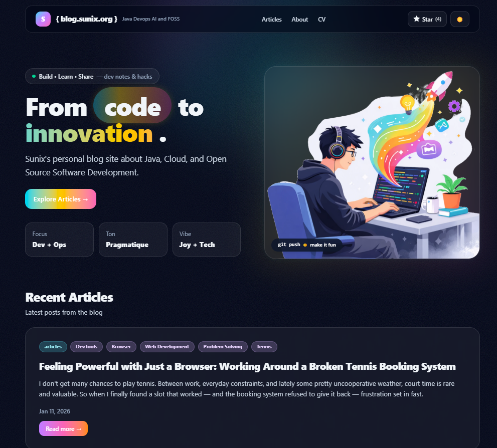
*After upgrading the dependencies, dark mode finally behaves as expected, proper background, proper contrast, fully readable content.*

## Minor but Important: Old URL Redirects

Another issue appeared after the migration.

Over the years, I had shared blog posts on social media using Jekyll-style URLs like:

`/articles/howto/2026/01/11/feeling-powerful-with-just-a-browser.html`


But the new Roq site uses cleaner URLs like:
`/posts/feeling-powerful-with-just-a-browser-working-around-a-broken-tennis-booking-system/`

The result?

Ugly 404 pages for old links.

Not great.

These links were already out there, on social media, in bookmarks, maybe even in other blog posts. Breaking them wasn’t acceptable.


### First Attempt: The Wrong Direction

Once again, I created an issue:  
👉 [https://github.com/sunix/blog.sunix.org/issues/80](https://github.com/sunix/blog.sunix.org/issues/80)

Copilot’s first solution was to generate static HTML redirect files using a separate `Main` class.

Technically, it worked.

But architecturally? I didn’t like it.

It felt like stepping outside the spirit of Quarkus Roq. It introduced a custom mechanism that lived outside the framework instead of using the tools already provided by Roq.

It solved the problem, but not in the right way.

### The Proper Way: Plugin Aliases

While researching, I discovered the **Roq plugin-aliases** feature:  
👉 [https://iamroq.com/docs/plugins/#plugin-aliases](https://iamroq.com/docs/plugins/#plugin-aliases)

That looked much cleaner.

So I commented directly in the pull request:

> @copilot  
> Sorry, I don’t like the idea of going outside Quarkus Roq with an external `Main` class.  
> Could we explore aliases instead?

That was the right direction.

The final implementation uses Roq’s alias mechanism properly:  
👉 [https://github.com/sunix/blog.sunix.org/pull/83/changes](https://github.com/sunix/blog.sunix.org/pull/83/changes)

Each old article now defines its legacy paths as aliases.

Yes, it required updating each article to declare its old URLs.  
But that’s actually what I wanted: explicit, controlled redirects, fully inside Roq.

Clean.  
Maintainable.  
Aligned with the framework.

# And That’s It

There were other small fixes and improvements along the way.

But these were the most interesting ones:

- redesigning without a theme
- using AI for mockups and iteration
- GitHub Issues Driven Development
- previewing PRs with `/preview`
- migrating to Quarkus Roq
- implementing excerpts properly
- fixing Tailwind for production
- handling old URL redirects cleanly
    

This whole journey wasn’t just about changing a blog engine.

It was about:

- reducing friction
- owning the design
- simplifying the stack
- and building in small, controlled iterations

AI has been a game changer in recent months. Things are moving very fast. I would never have done all of this without it.

Sometimes you have ideas, and you know how something works in theory, but implementing it is slow and painful. For me, CSS is one of those areas. It’s not that I don’t understand it… it’s just time-consuming and frustrating.

AI helped remove that friction.

But in the end, this isn’t just something generated by a machine. I now have a design that truly fits my personality. I made the decisions. I iterated. I refined. AI was a powerful assistant, not the author.

And honestly, I don’t think I would have gone this far without these tools.

That’s where I am right now.

If you’re considering moving to **Quarkus Roq**, or refreshing your blog design, I hope this gives you ideas, and maybe the confidence to try.

You don’t need to be a designer.
You don’t need to have weeks of free time.
You just need a few good issues… and a couple of coffee breaks ☕🚀

Last but not least, if you liked this post, feel free to leave a ⭐ on the GitHub repository of my blog [https://blog.sunix.org](https://blog.sunix.org). It helps me know the content was useful to someone 😉

Happy coding.
Happy blogging.